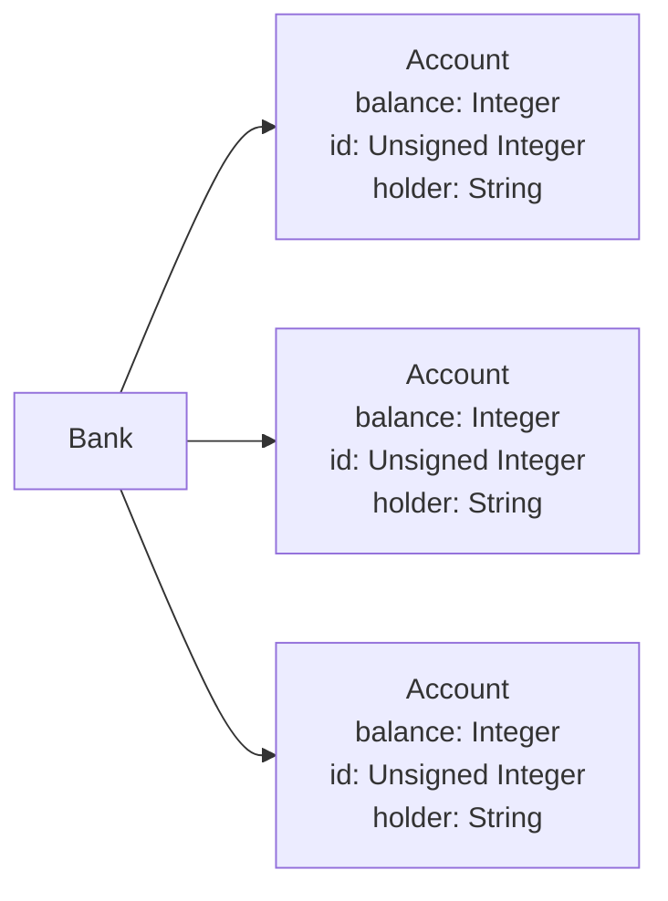

1. [Sec3](#sec3)
   1. [Project Planning](#project-planning)

# Sec3 

1. This section is focused in simulating a Bank DB. Using structs and methods in rust. 
2. This document will also haved a dump of notes

## Files 

Description of the files in this section:

file | What 
:--: | :--: 
[`w1.rs`](./w1.rs) | Testing shits 
[`mod.rs`](./mod.rs) | Exposes functions in the subfiles 
[`bank1.rs`](./bank1.rs) | Main banking App files will go in here 

## Project Planning 

1. Accounts will be sructs with the following fields:
   - balance: Integer
   - id: Unsigned Integer
   - holder: String