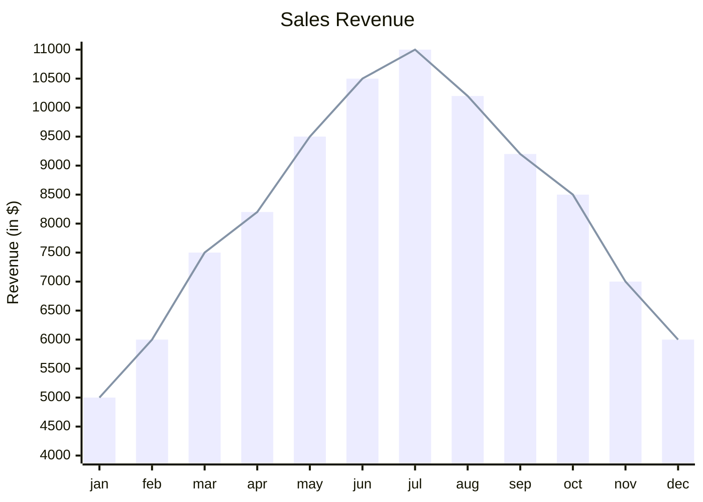

<h2 align="center"><code> Merz - Testing Weird Mermaid Diagrams </code></h2>

1. [Merz](#merz)
   1. [Charts](#charts)

# Merz

1. Testing out weird mermaid diagrams from [Mermaid Live Editor](https://mermaid.live/).

## Charts 

